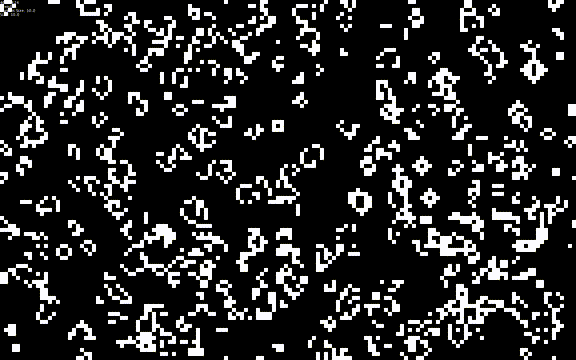

# Conway's Game of Life

[**Game of Life**](https://en.wikipedia.org/wiki/Conway%27s_Game_of_Life) is an example of a cellular automaton. It uses simple rules iterated over a space and time creating a mathmatical evolution.

